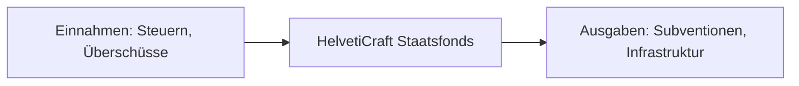
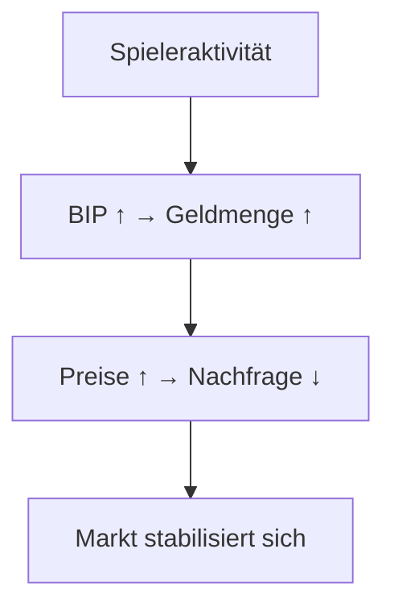

# HelvetiCraft_Economy_v3.0.2.md

### Design- und Architekturdokumentation für ein selbstregulierendes Schweizer Wirtschaftssystem in Minecraft

---

## 1. Einleitung

**HelvetiCraft Economy v3.0.2** ist ein volkswirtschaftlich inspiriertes, dynamisches Wirtschaftssystem für Minecraft, das sich am **Schweizer Modell** orientiert.  
Es bildet die Mechanismen von **Marktgleichgewicht**, **Steuerprogression**, **Mehrwertsteuer**, **Vermögens- und Einkommensverteilung**,  
sowie einen **staatlichen Fonds** für Subventionen und Grossprojekte ab.

Das System ist so entworfen, dass es:

- Selbstregulierend auf Angebot und Nachfrage reagiert  
- Ein internes **Bruttoinlandsprodukt (BIP)** nach **Verwendungsrechnung** führt  
- **Inflationsfaktoren (BIF)** trennt und zur Preisstabilität nutzt  
- Die Steuern über **konfigurierbare Server-Steuerprofile** verwaltet  
- **1-zu-1-Verkaufssteuer** und **Shopsteuer** unterscheidet  
- Über **Vault** an andere Ökonomiesysteme (z. B. GriefPrevention) andockt  

---

## 2. Grundprinzipien

HelvetiCraft folgt der Idee einer **Marktwirtschaft mit stabilisierender Staatseinwirkung**,  
basierend auf vier Säulen:

```
     ┌────────────────────┐
     │   Angebotsseite    │
     │ (Produktion, Land) │
     └────────┬───────────┘
              │
              ▼
 ┌────────────────────────────┐
 │  Marktgleichgewicht (P,Q)  │
 └────────┬───────────────────┘
          │
          ▼
 ┌────────────────────────────┐
 │   Staatlicher Einfluss     │
 │ (Steuern, Fonds, Gesetze)  │
 └────────┬───────────────────┘
          │
          ▼
┌────────────────────────────┐
│  Nachfrage (Konsum, Preise)│
└────────────────────────────┘
```


---

## 3. Wirtschaftliche Hauptgrössen

### 3.1 Bruttoinlandsprodukt (BIP)

Das **BIP** wird auf HelvetiCraft nach der **Verwendungsrechnung** berechnet.  
Es misst den Gesamtwert aller Ausgaben und Investitionen innerhalb der Serverwirtschaft in einer bestimmten Periode (z. B. pro Tag oder Woche).

Da HelvetiCraft **keinen Aussenhandel (Import/Export)** besitzt, gilt:

$$
\text{BIP} = \text{Spieler Einkauf} + \text{staatliche Konsumausgaben} + \text{Bruttoinvestitionen}
$$

---

#### Komponenten im Detail:

| Komponente | Beschreibung | Beispiele im Minecraft-System |
|------------|--------------|-------------------------------|
| **Spieler-Einkauf (C)** | Alle Transaktionen, bei denen Spieler Waren oder Dienstleistungen erwerben. | Shop-Käufe, 1-zu-1-Handel, NPC-Handel |
| **Staatliche Konsumausgaben (G)** | Zahlungen des Staatsfonds zur Stabilisierung oder Förderung der Wirtschaft. | Subventionen, Boni, Staatsfonds-Zahlungen, Krisenhilfen |
| **Bruttoinvestitionen (I)** | Investitionen in Infrastruktur oder Eigentum, inkl. Steuern als Investition in öffentliche Ordnung. | Landkäufe, neue Shops, Bauprojekte, Firmen, Steuerzahlungen |

**Beispiel:**

| Aktivität                 | Wert         |
|---------------------------|--------------|
| Spieler-Einkäufe          | 12 000 ₣     |
| Staatliche Konsumausgaben | 3 000 ₣      |
| Bruttoinvestitionen       | 5 000 ₣      |
| **BIP_total**             | **20 000 ₣** |

---

### 3.2 BasisInflationsFaktor (BIF)

Der **BIF** dient zur Stabilisierung der Preise.  
Er beschreibt, wie stark sich das Preisniveau durch **Geldmengenwachstum** im Verhältnis zum BIP verändert.

**Formel:**

$$
\text{BIF} = \frac{\Delta \text{Geldmenge}}{\Delta \text{BIP}}
$$

Ein BIF > 1 signalisiert Preisauftrieb (Inflation),  
ein BIF < 1 Deflation.  
Der Server passt Angebot/Nachfrage-Aktionen dynamisch an, um den **Zielbereich 0.98–1.05** zu halten.

---

### 3.3 Nachfrage & Angebot

Das System basiert auf einem vereinfachten Marktmodell.

**Nachfragefunktion (N):**

$$
N(p) = a - b \cdot p
$$

**Angebotsfunktion (A):**

$$
A(p) = c + d \cdot p
$$

**Marktgleichgewicht:**

$$
N(p) = A(p) \implies p^* = \frac{a - c}{b + d}
$$

`p*` ist der Gleichgewichtspreis, zu dem sich Angebot und Nachfrage ausgleichen.  
Dieser Wert wird als Referenz für dynamische Preisanpassungen genutzt.

---

## 4. Steuersystem

### 4.1 Übersicht

HelvetiCraft nutzt ein **mehrstufiges Steuermodell**, das auf realen Schweizer Prinzipien basiert.

**Arten von Steuern:**

| Kategorie | Beschreibung | Basis |
|---------|--------------|-------|
| Einkommensteuer | Progressiv, abhängig von Aktivität/Ertrag | Spieler-Einkommen |
| Vermögenssteuer | Progressiv, abhängig vom Kontostand | Spieler-Vermögen |
| Mehrwertsteuer | Linear, auf Handelsgeschäfte | Verkaufstransaktionen |
| 1-zu-1-Verkaufssteuer | Direktverkauf zwischen Spielern | Spieler-zu-Spieler-Verkauf |
| Shopsteuer | Für Shopsysteme | Verkauf über ChestShops/NPC-Shops |
| Landsteuer | Auf Besitzflächen, nach Wert und Nähe | Claim-Wert |
| Staatsfondsbeitrag | Anteil für Fondsfinanzierung | Automatisch aus Gesamteinnahmen |

---

### 4.2 Progressives Einkommensteuermodell

Die Einkommenssteuer steigt mit wachsendem Einkommen.

| Einkommensbereich | Steuersatz |
|-------------------|------------|
| 0 – 10 000 ₣      | 5 %        |
| 10 000 – 50 000 ₣ | 12 %       |
| 50 000 – 100 000 ₣| 20 %       |
| > 100 000 ₣       | 30 %       |

$$
ESt = \text{Einkommen} \times \text{Steuersatz(Einkommen)}
$$

---

### 4.3 Vermögenssteuer

Wird jährlich auf das Gesamtvermögen erhoben.

| Vermögen             | Steuersatz |
|----------------------|------------|
| 0 – 50 000 ₣         | 0.2 %      |
| 50 000 – 250 000 ₣   | 0.5 %      |
| > 250 000 ₣          | 1 %        |

$$
\text{VSt} = \text{Vermögen} \times \text{Steuersatz(Vermögen)}
$$

---

### 4.4 Mehrwertsteuer (MwSt)

Die MwSt wird auf jede Transaktion im Handelssystem erhoben.  
Sie fliesst direkt in den **Staatsfonds**.

$$
\text{MwSt} = \text{Verkaufspreis} \times \text{Satz}_{\text{MwSt}}
$$

Beispielwerte:

- Standard: **7.7 %**  
- Reduziert: **2.5 %** (Lebensmittel, Grundversorgung)

---

### 4.5 1-zu-1-Verkaufssteuer

Direktverkauf zwischen Spielern (ohne Shop) wird **höher besteuert**,  
um **das Shop-System zu fördern**.

$$
T_{1:1} = \text{Verkaufspreis} \times S_{1:1}
$$

- Standard: **3–5 % höher** als Shopsteuer  
- Fördert strukturierte Handelssysteme über Shops

---

### 4.6 Shopsteuer

Verkäufe über Shopsysteme oder NPC-Shops werden **niedriger besteuert**, um Handel und Wirtschaftsdynamik zu fördern.

$$
T_{Shop} = \text{Verkaufspreis} \times S_{Shop}, \quad S_{Shop} < S_{1:1}
$$

---

### 4.7 Landsteuer (Claimsteuer)

Landbesitz kostet periodisch Geld, abhängig von:

- Grösse  
- Lage (Nähe Spawn)  
- Entwicklungsgrad

$$
\text{ClaimSteuer} = \text{Basiswert} \times \text{Fläche} \times \text{LageFaktor}
$$

**LageFaktor-Beispiel:**

| Lage         | Faktor |
|--------------|--------|
| Zentrum      | 2.0    |
| Stadtgebiet  | 1.3    |
| Peripherie   | 0.8    |

---

### 4.8 Vollständige Begriffserklärung & Abläufe zwischen Käufern und Verkäufern

#### 4.8.1 Wirtschaftliche Hauptgrössen

| Begriff | Erklärung | Ablauf Käufer ↔ Verkäufer | Minecraft-Umsetzung |
|--------|-----------|----------------------------|---------------------|
| **Bruttoinlandsprodukt (BIP)** | Gesamtwert aller Ausgaben in der Serverwirtschaft pro Periode. | Käufer zahlt → C_total ↑<br>Verkäufer erhält → Teil von I_total<br>Staat zahlt Subventionen → G_total ↑ | Automatisch aus Transaktionen berechnet:<br>`BIP = C_total + G_total + I_total` |
| **Spieler-Einkauf (C)** | Alle Käufe von Waren/Dienstleistungen durch Spieler. | Käufer → Verkäufer (Shop/1:1) | Jede Transaktion erhöht C_total |
| **Staatliche Konsumausgaben (G)** | Zahlungen aus Staatsfonds für Subventionen, Boni, Projekte. | Staat → Spieler/Firmen | Automatisch aus Fonds |
| **Bruttoinvestitionen (I)** | Landkäufe, Shops, Bauprojekte, Steuerzahlungen als Investition in Ordnung. | Spieler → System (Land, Shop) | Steuern zählen als I |
| **BasisInflationsFaktor (BIF)** | Misst Geldmengenwachstum vs. BIP-Wachstum.<br>`BIF = ΔGeldmenge / ΔBIP`<br>Ziel: 0.98–1.05 | Beeinflusst Preise dynamisch | Server passt Preise an, wenn BIF ausserhalb Ziel |

---

#### 4.8.2 Steuerlogik: Inklusiv vs. Exklusiv

| Typ | Wann? | Käufer sieht | Verkäufer erhält | Staat erhält | Bestätigung? |
|-----|-------|--------------|------------------|--------------|--------------|
| **Inklusiv** | Shop, NPC | Endpreis (z. B. 10 ₣) | Netto | Steuer intern | Nein |
| **Exklusiv** | 1:1, Land, Einkommen | + Steuer sichtbar | Voll verlangt | Steuer extra | Ja (GUI) |

---

#### 4.8.3 Steuerarten – Begriffe, Abläufe, Umsetzung

| Steuer | Erklärung | Basis | Käufer → Verkäufer | Verkäufer → Staat | Minecraft-Ablauf |
|--------|-----------|-------|---------------------|-------------------|------------------|
| **Einkommensteuer** | Progressiv auf Einkommen | Spieler-Einkommen | – | Spieler → Staat | Periodisch (z. B. wöchentlich)<br>GUI: „Steuer: 5'040 ₣ [Zahlen]“ |
| **Vermögenssteuer** | Auf Kontostand | Spieler-Vermögen | – | Spieler → Staat | **Automatisch alle 3 Tage**<br>Nur wenn aktiv in letzten 10 Tagen<br>Chat: „325 ₣ abgezogen“ |
| **Mehrwertsteuer (MwSt)** | Linear auf Handel | Verkaufspreis | Käufer zahlt Bruttopreis | Verkäufer führt ab | **Inklusiv**<br>Intern: `MwSt = Preis × 7.7%` |
| **1-zu-1-Verkaufssteuer** | Höher als Shopsteuer | Direktverkauf | Käufer zahlt **Netto + Steuer** | Verkäufer → Staat | **Exklusiv mit Bestätigung**<br>Popup: „10 ₣ + 2.6 ₣ = 12.6 ₣ [Akzeptieren]“ |
| **Shopsteuer** | Niedriger als 1:1 | Shopverkauf | Käufer zahlt Bruttopreis | **Verkäufer zahlt als Kosten** | **Inklusiv**<br>Intern: `Shopsteuer = Preis × 2%` |
| **Landsteuer** | Periodisch auf Claims | Claim-Wert | – | Spieler → Staat | **Exklusiv mit GUI**<br>Alle 3 Tage: „1'050 ₣ [Zahlen]“ |
| **Staatsfondsbeitrag** | Anteil aller Steuern | Automatisch | – | Alle Steuern → Fonds | Intern, unsichtbar |

---

#### 4.8.4 Ablauf: Shopkauf (ChestShop) – Schritt für Schritt

**Beispiel**: Aram kauft 10 Dirt bei Spyros für **10 ₣** (Bruttopreis)

| Schritt | Wer | Was | Betrag | Art |
|--------|-----|-----|--------|-----|
| 1 | Aram → Spyros | Zahlung | 10 ₣ | Bruttopreis (inkl. MwSt) |
| 2 | System | MwSt berechnen | 0.77 ₣ | 7.7 % |
| 3 | System | Shopsteuer berechnen | 0.20 ₣ | 2 % |
| 4 | Spyros → Staat | MwSt abführen | 0.77 ₣ | Umsatzsteuer |
| 5 | Spyros → Staat | Shopsteuer zahlen | 0.20 ₣ | Betriebskosten |
| 6 | Spyros | Netto behalten | 9.03 ₣ | Gewinn |

**Chat-Feedback**:
```
Aram: Du hast 10x Dirt für 10 ₣ gekauft (inkl. 0.77 ₣ MwSt)
Spyros: Du hast 9.03 ₣ erhalten (nach 0.97 ₣ Steuern)
```

---

#### 4.8.5 Ablauf: 1-zu-1-Verkauf (/sell)

**Beispiel**: Aram verkauft Spyros 10 Dirt für **10 ₣ Netto**

| Schritt | Wer | Was | Betrag | Art |
|--------|-----|-----|--------|-----|
| 1 | System | Steuer berechnen | 2.6 ₣ | 26 % |
| 2 | Spyros | Popup sieht | 10 ₣ + 2.6 ₣ = **12.6 ₣** | Exklusiv |
| 3 | Spyros | Bestätigt | [Akzeptieren] | GUI |
| 4 | Spyros → Aram | Zahlung | 10 ₣ | Netto |
| 5 | Spyros → Staat | Steuer | 2.6 ₣ | 1:1-Steuer |

**Popup bei Spyros**:
```
Aram verkauft dir 10x Dirt
Preis: 10 ₣
+ Steuer: 2.6 ₣
= Gesamt: 12.6 ₣
[✔ Akzeptieren] [✖ Ablehnen]
```

---

#### 4.8.6 Landsteuer – Schweiz vs. HelvetiCraft

**Schweiz**:
- **Name**: Grundsteuer
- **Basis**: Katasterwert × Steuersatz (kantonal, 0.1–0.5 %)
- **Faktoren**: Fläche, Lage, Bebauung
- **Intervall**: Jährlich
- **Zweck**: Gemeindefinanzierung

**HelvetiCraft – Realistische Umsetzung**:

```java
ClaimSteuer = Basiswert × Blöcke × LageFaktor × Entwicklungsfaktor
```

| Faktor | Erklärung | Beispiel |
|-------|----------|---------|
| **Basiswert** | Preis pro Claim-Block | 1 ₣ |
| **Blöcke** | Anzahl Claim-Blöcke | 64 |
| **LageFaktor** | Nähe zu Spawn | Zentrum = 2.0 |
| **Entwicklungsfaktor** | Nähe zu anderen Claims | 6 Nachbarn → 1.3 |

**Beispiel**:
```
1 × 64 × 2.0 × 1.3 = 166.4 ₣ alle 3 Tage
```

**Ablauf**:
1. Folia-Scheduler → alle 3 Tage
2. Prüft: Spieler aktiv in letzten 10 Tagen?
3. Berechnet Steuer pro Claim
4. Automatisch abziehen oder GUI: „166 ₣ [Zahlen]“
5. Bei Nichtzahlung → Mahnung → Claimverlust

**BonusClaimBlocks**:
- Reduzieren Basiswert → Investitionsanreiz

---

#### 4.8.7 Quiz-System – Alle 10 Minuten

**Mechanik**:
- **Intervall**: Alle 10 Minuten
- **Frage**: Zufällig im Chat
- **Antwort**: Erster richtiger → Gewinnt

**Belohnung**:

| Platz | Belohnung |
|------|----------|
| **1.** | +3 XP-Level<br>+10 Quiz-Punkte |
| **Top 4 (nach Punkten)** | Kosmetischer Titel (kein Gameplay-Vorteil) |

**Ränge (Top 4)**:

| Rang | Titel | Anzeige |
|------|-------|--------|
| 1 | Quizmeister | `[Quizmeister] Aram` |
| 2 | Rätselkönig | `[Rätselkönig] Spyros` |
| 3 | Denkmeister | `[Denkmeister] Lina` |
| 4 | Schlaumeier | `[Schlaumeier] Max` |

**Ablauf**:
1. Server: `Wie viele Blöcke hat ein Chunk?`
2. Erster mit `4096` → gewinnt
3. `player.giveExpLevels(3)` + `punkte += 10`
4. Rangliste aktualisiert → Titel zugewiesen
5. Nächste Frage in 10 Minuten

**Technik**:
- Folia Scheduler
- ChatListener
- YAML für Punkte
- Scoreboard/Nametag für Titel

---

## 5. Staatsfonds-System

Der **HelvetiCraft-Staatsfonds** bleibt das zentrale Stabilisierungselement.  
Er finanziert die **staatlichen Konsumausgaben (G)** im BIP.

### Einnahmequellen:
- Einkommensteuer  
- Vermögenssteuer  
- Mehrwertsteuer  
- Landsteuer  
- Überschüsse aus 1-zu-1-Verkäufen & Shops  

### Ausgaben:
- Subventionen  
- Infrastruktur (Serverprojekte, Spawn, Events)  
- Krisenintervention (Deflationsphasen)  



---

## 6. Marktmechanik & Selbstregulation

Das System reguliert sich automatisch durch **Rückkopplungsschleifen**:



Der **Inflationsfaktor (BIF)** wird genutzt, um extreme Schwankungen zu dämpfen.

---

## 7. Server-Steuerprofil (Law Profile)

Das **Server-Steuerprofil** definiert alle wirtschaftspolitischen Parameter.  
Es kann vom Administrator verändert werden, um wirtschaftliche Szenarien zu simulieren.

### Beispiel: Standardprofil „HelvetiCraft – Stabilität“

| Parameter | Wert | Beschreibung |
|---------|------|--------------|
| Einkommensteuer | progressiv | sozial ausgewogen |
| Vermögenssteuer | aktiv | geringe Umverteilung |
| MwSt | 7.7 % Standard | stabile Preisbasis |
| 1-zu-1-Verkaufssteuer | 5 % | Direktverkauf höher besteuert |
| Shopsteuer | 2 % | Verkauf über Shops gefördert |
| Landsteuer | aktiv | wertabhängig |
| Staatsfondsquote | 25 % | anteilig an Steuern |
| Inflationsziel (BIF) | 1.02 | leichte Wachstumsförderung |
| Wachstumstoleranz (ΔBIP) | ±10 % | Stabilitätsgrenze |

---

## 8. Datenstrukturen (konzeptionell)

| Variable | Bedeutung |
|----------|-----------|
| `BIP_total` | Gesamtwert der Verwendungsrechnung |
| `C_total` | Summe aller Spieler-Transaktionen |
| `G_total` | Staatliche Konsumausgaben |
| `I_total` | Bruttoinvestitionen (Land, Shops, Steuern, Gebäude) |
| `BIF_rate` | Inflations-/Deflationsrate |
| `TAX_*` | Einzelne Steueraufkommen |
| `FUND_balance` | Staatsfondsvermögen |
| `PLAYER_wealth[i]` | Vermögen jedes Spielers |

---

## 9. Balance- und Stabilitätsleitlinien

Aktualisiert für BIP nach Verwendungsrechnung:

1. **BIP-Zielwachstum:** 3 – 6 % pro Serverperiode  
2. **Inflationsziel (BIF):** 0.98 – 1.05  
3. **Fondsreserve:** Mindestens 15 % des BIP  
4. **Einkommensverteilung:** Top 10 % der Spieler ≤ 50 % des Gesamtvermögens  
5. **Investitionsquote (I/BIP):** 20–30 %  
6. **Konsumquote (C/BIP):** 50–70 %  
7. **Staatsquote (G/BIP):** 10–20 %  
8. **1-zu-1-Verkaufssteuer** > **Shopsteuer**, um Shops zu fördern  

---

## 10. Zukünftige Erweiterungen

- Mehrere simultane **Kantonale Steuerprofile**  
- Dynamische Subventionierung nach Spieleraktivität  
- Staatsanleihen für Investitionsprojekte  
- Öffentliche Ausschreibungen für Bauprojekte  
- Monetäre Simulation über dynamische Geldschöpfung  

---

## 11. Fazit

HelvetiCraft Economy v3.0.2 verbindet **wirtschaftliche Komplexität** mit **spielerischer Stabilität**.  
Es ermöglicht langfristige Server-Ökonomie, die sich am **realen Schweizer System** orientiert:  
sozial, progressiv, stabil, und mit einem Gleichgewicht zwischen **Freiheit und Verantwortung**.

**Formel:**

$$
\text{BIP} = \text{Spieler Einkauf} + \text{staatliche Konsumausgaben} + \text{Bruttoinvestitionen}
$$

---

## 12. Preisempfehlung für Shops

Um ein **selbstregulierendes Preissignal** für Shops zu generieren, wird eine **dynamische Empfehlung** berechnet.  
Dabei wird berücksichtigt:

- **BIP_total**: Gesamtwert der Wirtschaft  
- **BIF_rate**: Inflations-/Deflationsfaktor  
- **Nachfrage- und Angebotsverhältnis** für jedes Item  
- **Basiswert des Items** (z. B. Edelmetall, Rohstoff, besondere Items)

### 12.1 Berechnung des empfohlenen Verkaufspreises

**Variablen:**

| Variable | Bedeutung |
|--------|----------|
| `BaseValue_i` | Grundwert des Items i |
| `DR_i` | Demand Ratio für Item i = (Nachfrage + 1) / (Angebot + 1) |
| `BIP_total` | Gesamtwirtschaftlicher Wert aller Transaktionen |
| `BIF_rate` | Inflationsfaktor zur Stabilisierung der Preise |
| `q` | Menge des Items |

**Schritt 1 – Rohpreis**

$$
\text{RawPrice}_i = \text{BaseValue}_i \times \text{BIF\_rate}
$$

**Schritt 2 – Nachfragefaktor**

$$
\text{DemandFactor}_i =
\begin{cases} 
1 + k \cdot \log_2(DR_i) & \text{wenn } DR_i > 1\\[2mm]
1 - k \cdot \log_2(1 / DR_i) & \text{wenn } DR_i < 1\\[1mm]
1 & \text{wenn } DR_i = 1
\end{cases}
$$

- `k` ist ein Anpassungskoeffizient (z. B. 0.03–0.05)  
- Das logarithmische Verfahren verhindert extreme Preissprünge bei kleinen Mengen

**Schritt 3 – Mengenanpassung**

$$
\text{Price}_i(q) = \text{RawPrice}_i \times \text{DemandFactor}_i \times q
$$

**Schritt 4 – Steuerintegration**

Für Shopsystem:

$$
\text{NetPrice}_{Shop} = \text{Price}_i(q) \times (1 + T_{Shop})
$$

Für 1-zu-1-Verkauf:

$$
\text{NetPrice}_{1:1} = \text{Price}_i(q) \times (1 + T_{1:1})
$$

**Hinweis:** `T_{1:1} > T_{Shop}` um Direktverkäufe zu dämpfen.

---

### 12.2 Beispiel

- Item: Eisenbarren  
- `BaseValue = 5 ₣`  
- `BIF_rate = 1.02`  
- Menge `q = 64`  
- Nachfrage: DR = 1.5  
- Shopsteuer: 2 %  
- 1-zu-1-Steuer: 5 %

**Berechnung:**

1. `RawPrice = 5 × 1.02 = 5.1 ₣`  
2. `DemandFactor = 1 + 0.03 × log₂(1.5) ≈ 1.017`  
3. `Price(q) = 5.1 × 1.017 × 64 ≈ 331.6 ₣`  
4. `NetPrice_Shop = 331.6 × 1.02 ≈ 338 ₣`  
5. `NetPrice_1to1 = 331.6 × 1.05 ≈ 348 ₣`

**Interpretation:** Der Shop-Preis ist niedriger als der 1-zu-1-Preis, um Shops attraktiver zu machen.

---

### 12.3 Vorteile des Systems

- Dynamisch an **Marktbedingungen angepasst**  
- Verhindert extreme Preissprünge bei Inflation oder Deflation  
- Fördert den **Shop-Handel** durch niedrigere Steuerbelastung  
- Einfach auf neue Items oder Event-Märkte erweiterbar  

---

## 13. Logische Erweiterungen & Optimierungsmöglichkeiten

1. **Dynamische Shoppreise pro Region:**  
   - Unterschiedliche Preise basierend auf Entfernung zu Spawn oder beliebten Handelsplätzen.

2. **Event-basierte Preisänderungen:**  
   - Saisonale Items oder Server-Events können Nachfragefaktoren temporär verändern.

3. **Automatische Subventionssteuerung:**  
   - Staatsfonds kann gezielt bestimmte Rohstoffe günstiger machen oder Knappheit ausgleichen.

4. **Landwert-Dynamik:**  
   - Anpassung der Landsteuer bei starker Nachfrage, z. B. nahe Spawn-Regionen.

5. **BIP-Analysen für Wirtschaftspolitik:**  
   - Warnungen bei starkem Wachstum/Deflation und automatisches Anpassen von BIF oder Steuersätzen.

6. **Mehrstufige Shop-Typen:**  
   - NPC-Shops, Spieler-Shops, Auktionshäuser mit unterschiedlichen Steuersätzen.

7. **Spieler-Ökonomisches Reporting:**  
   - Dashboard für Spieler: Vermögen, durchschnittliche Preise, BIP-Anteil, Steuerlast.

8. **Preis-Cap / Floor:**  
   - Minimale und maximale Preise für seltene Items, um Extremspekulationen zu verhindern.